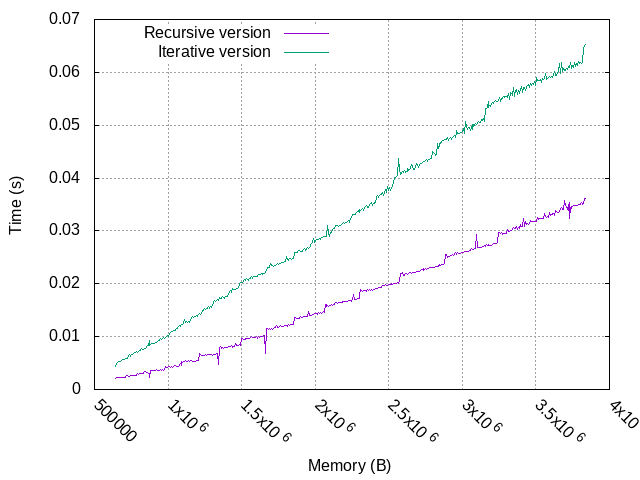

# AVL_tree
 Implementation in C of binary search tree + avl tree.
 An AVL tree is a self-balancing binary search tree, named after inventors Adelson-Velsky and Landis (Wikipedia).



# Tests

To compile the tests, run
```
make tests
```

To run the tests :
```
make check
```

# Run benchmark and draw plots

```
# make sure your os is quiesced for better results
make benchmark

# csv files are under data/csv
make run_local_benchmark

# plot is under data/plots
make plots
```

# Run Massif analysis
```
make massif_analysis
```


# Want to contribute ?

```
find * -name *.[ch] -type f | xargs grep -n TODO
```

# TODO

- avl_tree: insert, delete operations
- sum_types/inheritance for tree/bst/avl_tree
